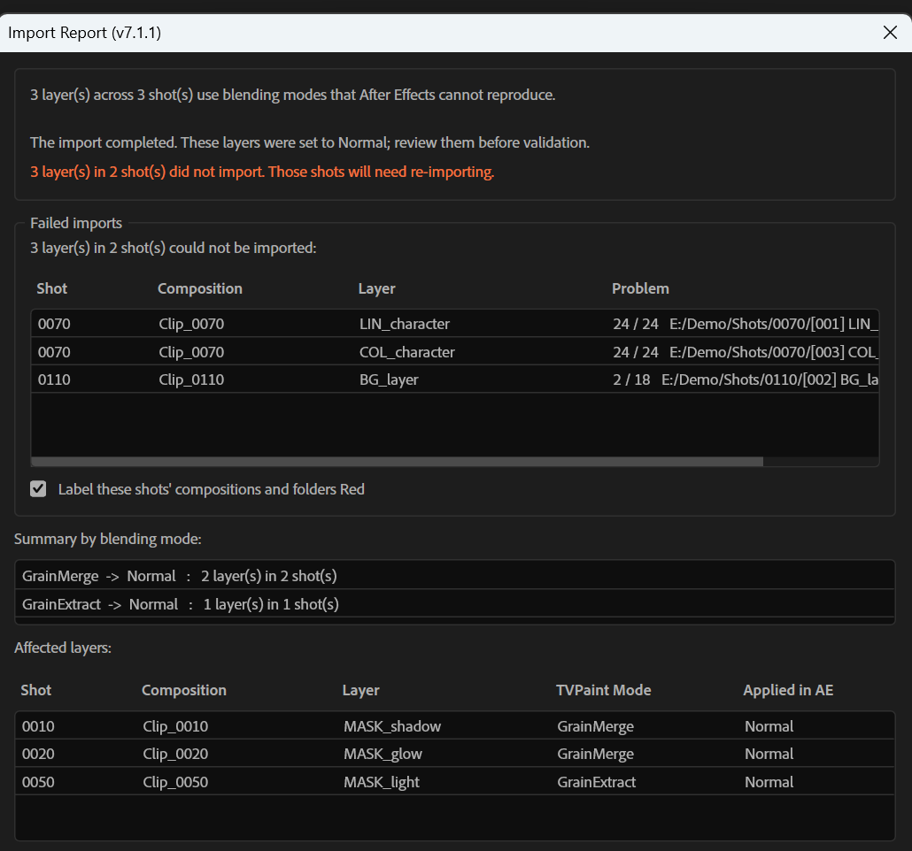

# TVPaint JSON Importer++ for Adobe After Effects

An enhanced ExtendScript importer for loading TVPaint Animation projects exported as JSON into Adobe After Effects.

Compatible with **TVPaint 11 / TVPaint 12** and **Adobe After Effects (CS5 through CC 2026+)**.

*GitHub opens `.jsx` files as plain text — **right-click the button → "Save link as…"** to save the file directly.*

> [!NOTE]
> **Disclaimer**: Built and vibecoded with Google Antigravity and Claude Code. It works reliably for our production workflow (native sequences, shot folder batching), but has not been tested beyond that.

---

## Features & Improvements

### Batch importing
- **Interactive Shot Browser** — browse shot folders with Date Modified, filter by name, multi-select with `Shift`/`Ctrl`.
- **Multi-shot import** — finds the matching `.json` in each selected folder and imports them in sequence, with progress.
- **Single-shot import** — a file picker on the main panel, straight to one `.json` without the browser.
- **Automatic comp naming** — `Clip_<shotName>`.
- **Settings persistence** — UI options and root folder are remembered between sessions.

### Import Report
- **No modal interruptions** — problems are collected during the run and shown once at the end, so a large batch can be left alone.
- **Two reporting modes** — one summary when the import finishes, or an alert on each problem.
- **Failed imports first** — layers whose frames are missing are skipped, listed, and flagged; the rest of the batch still imports.
- **Fix blending modes in place** — select layers, pick a mode, apply. Clicking a summary row selects every layer using that mode.
- **Red labels** — failed shots' comps and folders (on by default); unresolved layers (off by default).
- **Saveable log** — a short text file listing what to re-import and what was substituted.
- **Resizable** — stays readable at 100 shots.

### Under the hood
- **Native sequences by default** — faster imports and native AE caching.
- **Headless API** — `$.global.ImportTVPaintJSON` for external batch scripts.
- **Four languages** — English, French, Japanese, Chinese.

---

## Installation

1. [📥 Click here to download the `.jsx` script](https://raw.githubusercontent.com/bizmar/tvpaint-ae-importer/main/AfterEffects_Import%20TVPaint_JSON_7._1%2B%2B.jsx) — **right-click the link -> *Save link as...*** to save it directly, otherwise the browser will just display the code.
2. Copy `AfterEffects_Import TVPaint_JSON_7._1++.jsx` into your After Effects Scripts folder:
   - **Windows:** `C:\Users\<User>\AppData\Roaming\Adobe\After Effects\<Version>\Scripts\` (or `C:\Program Files\Adobe\Adobe After Effects <Version>\Support Files\Scripts\`)
   - **macOS:** `/Applications/Adobe After Effects <Version>/Scripts/`
3. Run the script inside After Effects via **File > Scripts > AfterEffects_Import TVPaint_JSON_7._1++.jsx**.

> [!TIP]
> **Assign a keyboard shortcut.** After restarting After Effects (2020 or newer), open **Edit > Keyboard Shortcuts**, search for `TVPaint`, click the script's shortcut column and press your key combination.
>
> Placing the `.jsx` in `Scripts/ScriptUI Panels` instead makes it a dockable panel under the **Window** menu, which can be given a shortcut the same way.

---

## Usage

1. Launch the script and click **"Select Shots (Shot Browser)..."**.
2. Select your root shots directory. The path will be remembered for future sessions.
3. Select one or multiple shot folders (`Shift+Click` for ranges, `Ctrl+Click` for individual shots).
4. Click **"Import Selected Shots"** — all selected shots will be loaded and built automatically.

---

## Screenshots

**Shot Browser** — pick one or many shots to import. The main panel also has a direct picker for a single `.json`.

**Import Report** — shown once when the run finishes.

> [!NOTE]
> A file that is *present but corrupt* is not detected: the check confirms every
> frame exists, not that it is readable. After Effects imports such a file without
> complaint. See [docs/TESTING.md](docs/TESTING.md) for what has been verified.

---

## Credits & License

- Original script created by Clément Berthaud, Matthieu Tragno, and Kévin Lobjois for **TVPaint Développement**.
- Official documentation and downloads: [TVPaint 12 Documentation - After Effects Import](https://www.tvpaint.com/doc/tvp12/index.php?id=after-effects-import)
- All original rights, trademarks, and code belong to [TVPaint Développement](https://www.tvpaint.com).
- As declared in the original script header, this work is licensed under [Creative Commons Attribution-NonCommercial-ShareAlike 4.0 International License (CC BY-NC-SA 4.0)](https://creativecommons.org/licenses/by-nc-sa/4.0/).
