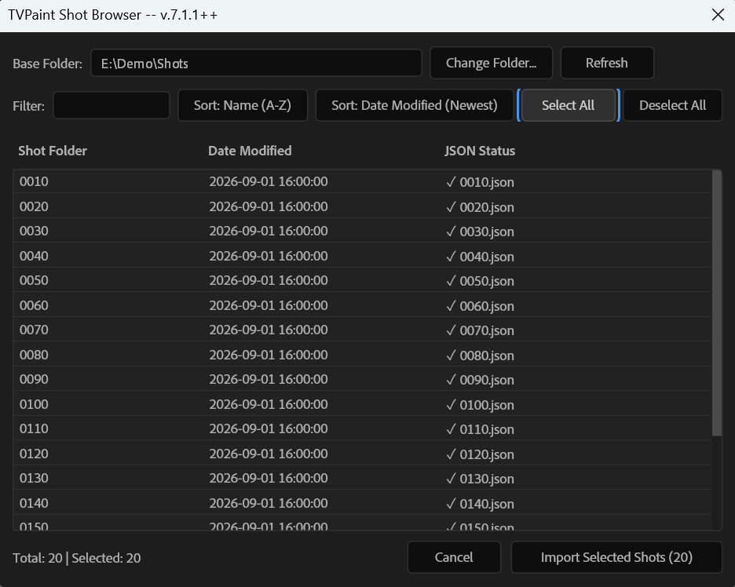

# TVPaint JSON Importer++ for Adobe After Effects

An enhanced ExtendScript importer for loading TVPaint Animation projects exported as JSON into Adobe After Effects.

Compatible with **TVPaint 11 / TVPaint 12** and **Adobe After Effects (CS5 through CC 2026+)**.

> [!NOTE]
> **Disclaimer**: Built and vibecoded with Google Antigravity. It works reliably for our production workflow (native sequences, shot folder batching), but has not been tested beyond that.

---

## Features & Improvements

- **Interactive Shot Browser**: Dedicated in-app browser listing all shot folders with **Date Modified** timestamps, real-time name filtering, and multi-selection (`Shift+Click` / `Ctrl+Click`).
- **Batch Multi-Shot Import**: Automatically locates the matching `.json` inside each selected shot folder and batch-imports all shots sequentially with progress tracking.
- **Smart Preferences Persistence**: Automatically saves and restores your last-used UI settings and root folder between After Effects sessions via `app.settings`.
- **Automatic Comp Naming**:
  - `main` branch: automatically names compositions `Clip_<shotName>` (e.g. `Clip_shot_010`).
  - `feat/grainmerge-suppression` branch: names compositions `<shotName>_comp` (e.g. `shot_010_comp`).
- **Native Sequence Mode by Default**: Defaults to native image sequences for faster imports and native AE caching.
- **Headless / Automation Ready**: Decoupled core import function `$.global.ImportTVPaintJSON` for external batch scripts.

---

## Screenshot

---

## Installation

1. [📥 Click here to download the `.jsx` script](https://raw.githubusercontent.com/bizmar/tvpaint-ae-importer/feat/grainmerge-suppression/AfterEffects_Import%20TVPaint_JSON_7._1%2B%2B.jsx) (or right-click -> *Save link as...*).
2. Copy `AfterEffects_Import TVPaint_JSON_7._1++.jsx` into your After Effects Scripts folder:
   - **Windows:** `C:\Users\<User>\AppData\Roaming\Adobe\After Effects\<Version>\Scripts\` (or `C:\Program Files\Adobe\Adobe After Effects <Version>\Support Files\Scripts\`)
   - **macOS:** `/Applications/Adobe After Effects <Version>/Scripts/`
3. Run the script inside After Effects via **File > Scripts > AfterEffects_Import TVPaint_JSON_7._1++.jsx**.

---

## Usage

1. Launch the script and click **"Select Shots (Shot Browser)..."**.
2. Select your root shots directory (e.g. `inAnim/`). The path will be remembered for future sessions.
3. Select one or multiple shot folders (`Shift+Click` for ranges, `Ctrl+Click` for individual shots).
4. Click **"Import Selected Shots"** — all selected shots will be loaded and built automatically.

---

## Credits & License

- Original script created by Clément Berthaud, Matthieu Tragno, and Kévin Lobjois for **TVPaint Développement**.
- Official documentation and downloads: [TVPaint 12 Documentation - After Effects Import](https://www.tvpaint.com/doc/tvp12/index.php?id=after-effects-import)
- All original rights, trademarks, and code belong to [TVPaint Développement](https://www.tvpaint.com).
- As declared in the original script header, this work is licensed under [Creative Commons Attribution-NonCommercial-ShareAlike 4.0 International License (CC BY-NC-SA 4.0)](https://creativecommons.org/licenses/by-nc-sa/4.0/).
